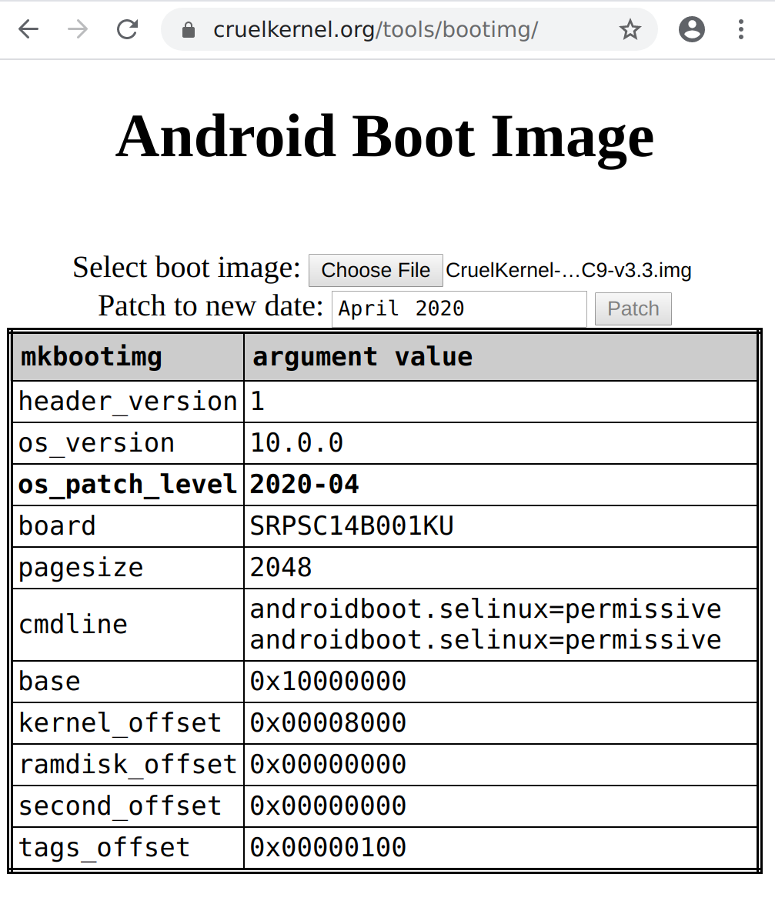
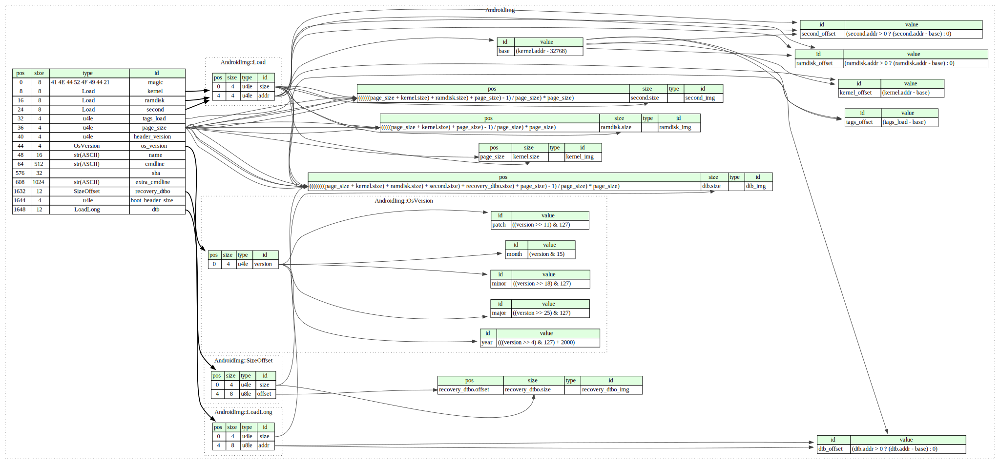

# Android Boot Image Info Dumper

Serverless page that dumps info for mkbootimg arguments.
Allows one to chage the os_patch_level date for recovery && boot images.

<table>
    <tr>
        <td>
            
        </td>
        <td>
            
        </td>
    </tr>
</table>